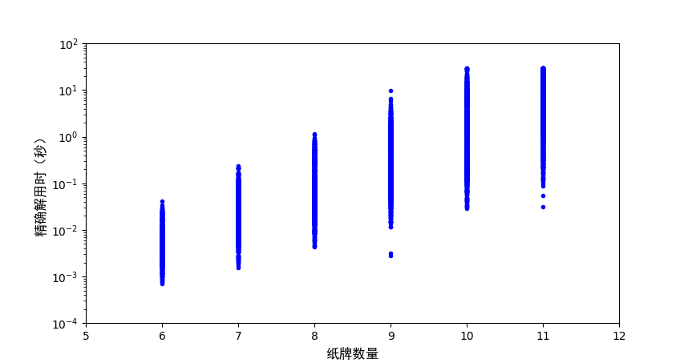
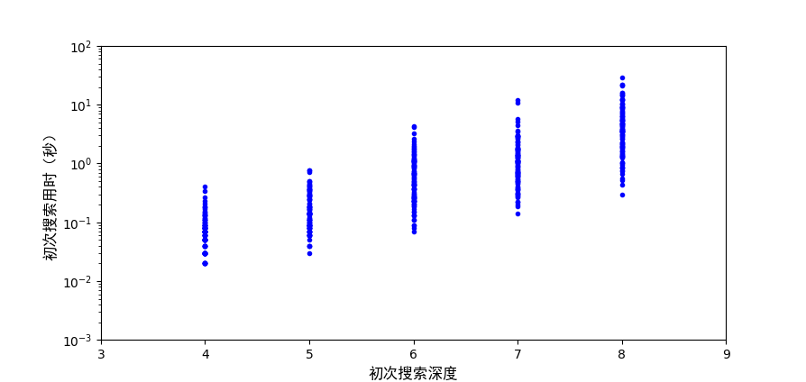
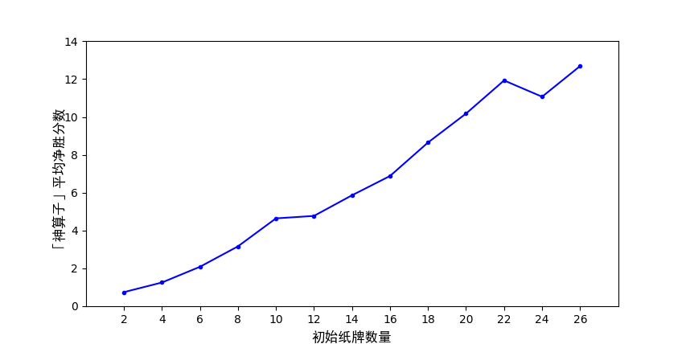

# 引言

## 博弈智能体设计概述

博弈可以形式化为包含如下要素的搜索问题：

- **状态** `state`
- **行动** `action`
- **生枝函数** `branch(state) -> list[action]`
- **演化函数** `evolve(state, action) -> state`
- **终止判断** `isTerminated(state) -> bool`
- **效用函数** `evaluate(state) -> real`
- **效用估计函数** `estimate(state) -> real`

## 博弈智能体设计史

### 「标准方法」 = 极大极小化算法 + $α$-$β$ 剪枝 + 效用估计函数

- 1912, Ernst Zermelo：**极小极大化算法**
- 1956, John McCarthy：**$α$-$β$ 剪枝**。

1997 年，基于「标准方法」的深蓝（Deep Blue）计算机击败了当时的世界冠军 Garry Kasparov。

### Monte Carlo 树搜索法

21 世纪以来，**Monte Carlo 树搜索算法**逐渐成为了博弈智能体的主流。

以围棋为例，2009 年以后所有一流的围棋智能体均使用 Monte Carlo 树搜索算法，大名鼎鼎的 AlphaGo 和 AlphaGo Zero 也不例外。[^ai]

### 本项目的选择

尽管「标准方法」的效率不够高，但考虑到 Big2 纸牌游戏的搜索空间不大以及设计效用估计函数的可行性，本项目中仍然采用该方法。

# 基本算法

## 状态与行为

- 将纸牌 3, 4, ..., 2 映射为指标 0, 1, ..., 12，用长度为 13 的列表存储
- 充分思考各种牌型的相同点与不同点，认为任何牌型可以**参数化**地由 5 个要素描述：

1. **主牌指标**：例如牌型 `33344456` 的主牌指标是 `1`；
2. **长度**：例如牌型 `33344456` 的长度是 `2`；
3. **容量**（主牌在牌型中出现的次数）：例如牌型 `33344456` 的容量是 `3`；
4. **带牌容量**（在（连）三带一或（连）三带二中带牌的张数）：例如牌型 `33344456` 的带牌容量是 `1`；
5. 带牌的具体内容。

前 4 个要素为关键要素，第 5 个要素为非关键要素。我们用一个**牌型四元组**表示一个牌型，而忽略带牌的具体内容。

## 基于动态规划的生枝函数

动态规划：主牌指标不大于 `i` 的所有牌型 + 主牌指标为 `i + 1` 的所有牌型 = 主牌指标不大于 `i + 1` 的所有牌型

### 上一轮对手不出

- 对手牌列表进行一次遍历
  - 对每个主牌指标依次判断相应纸牌是否至少有 1 张、2 张和 3 张
  - 定义「连击数」变量，记录对容量为 1、2、3、4 的不同情况，分别已经有几个连续的点数，并不断累加
    - 例如，手牌为 `4556667777` 时「连击数」分别为 4、3、2、1
  - 根据「连击数」找出所有以当前指标为主牌指标的牌型，包括各种长度的牌型
- 若不考虑带牌导致的再次遍历，则时间复杂度最差情况下为 $O(n^2)$，一般为 $O(n)$。

### 上一轮对手出牌

方法类似，但只需要考虑特定长度、容量和带牌容量的牌型，且动态规划的起点是对手的主牌指标 + 1。

# 精确解

## 引言

水浒传中，排行五十三位的蒋敬乃潭州人氏，落科举子出身；原为黄门山二寨主，后因钦慕宋江而到梁山入伙，负责考算山寨钱粮。蒋敬精通书算，用算盘运算时能「积万累千，纤毫不差」，人称「神算子」。一百二十回本中有诗赞曰：「如神算法善行兵，文武全才蒋敬」。

## 智能体「神算子」

我们将本组设计的智能体称为「神算子」（英文：Awesome Big2 Agent）[^app2]，它的目标是尽可能接近最优解：

- 「神算子」：极大化自己的效用
- 对手：极小化「神算子」的效用

这一过程可以用伪代码表示为[^minimax]：

```python
def minimax(state):
    if isTerminated(state):
        return evaluate(state)
    if current player is AwesomeBig2Agent:
        return max(minimax(evolve(state, action))
            for action in branch(state))
    else # current player is Opponent
        return min(minimax(evolve(state, action))
            for action in branch(state))
```

[^app2]: 命名灵感来自手机游戏「欢乐斗地主」的残局模式。

[^minimax]: https://en.wikipedia.org/wiki/Minimax

## 从极小极大化到负值极大化

不过，这一算法的缺点是很多代码要重复写两遍。为此我们采用与极小极大化算法等价的一套表述，即负值极大化算法：由于博弈是零和博弈，状态对「神算子」的效用总是对对手的效用负值，因此只需要每次都取最大值，并将各个分支上的效用取负值即可。它的伪代码表示为[^negamax]:

[^negamax]: https://en.wikipedia.org/wiki/Negamax

```python
def negamax(state):
    if isTerminated(state): return evaluate(state)
    return max(-negamax(evolve(state, action))
        for action in branch(state))
```

## 缓存

显然，负值极大化算法是一个递归算法，通过加入缓存可以大大提高其效率。缓存逻辑的伪代码可以表示为一个装饰器（尽管实际并不采用装饰器实现）：

```python
def decorator(negamax):
    def wrapper(state):
        if state in cache: return cache[state]
        utility = negamax(state)
        cache[state] = utility
        return utility
    return wrapper
```

在具体实现中，我们用己方手牌列表和对方手牌列表分别元组化后和牌型四元组相加，得到的 30 元组作为字典的键。

## $\alpha$-$\beta$ 剪枝

若在某一层中对手已经发现了一个使我们获得较少效用的树枝，则其余极小极大值大于该效用值的树枝都是无效的，此时可以立即截断该树枝的计算并返回。

用 $\alpha$ 代指该条路径上己方效用的极大值，$\beta$ 代指该条路径上对方能使己方效用达到的最小值，则伪代码可以表示为：

```python
def negamax(state, alpha, beta):
    if isTerminated(state): return evaluate(state)
    utility = MIN_UTILITY
    for action in branch(state):
        newState = evolve(state, action)
        utility = max(value, -negamax(newState, -beta, -alpha))
        alpha = max(alpha, value)
        if alpha >= beta: break
    return utility
```

## 剪枝排序

对 $\alpha$-$\beta$ 剪枝来说，若我们将比较有优势的树枝放在前面访问，则倾向于能剪掉更多的树枝。我们对树枝作出以下排序：

1. 如果自己出牌前对手出牌：
   1. 属于同一类牌型的、大于对手的、主牌尽可能小的牌型；
   2. 主牌尽可能小的炸弹；
   3. 不出。
2. 如果自己出牌前对手不出：
   1. 总牌数尽可能多、主牌尽可能小的牌型；
   2. 主牌尽可能小的炸弹；

即在已知信息有限时，我们总是倾向于出尽可能长、尽可能小的牌，使得我们在之后的优势可能较大。这一选择与游戏的评分机制有关。

# 近似解

## 估计函数

经缓存和 $\alpha$-$\beta$ 剪枝加速的「神算子」已经能够对「10 + 10」以内（指双方均不超过 10 张牌）的问题瞬间完成求解，但由于手牌的上限为 26 张，当前的「神算子」还不能满足需求。

需要对非叶节点设计效用估计函数，搜索到一定深度时就返回，而不是搜索至牌局结束。

- ——怎么设计？
- ——避繁就简、重剑无锋：**一个非叶节点的效用估值是对方剩余纸牌数量减去己方剩余纸牌数量。**

## 迭代深入搜索

- 固定深度搜索：不容易估计合适的深度
- **迭代深入搜索**：首先设定初始深度，搜索完成后逐渐增加搜索深度，保存每一步所得到的最优牌型；一旦时间截止，则立刻返回目前所进行的最深搜索所给出的解

用于控制时间的伪代码可以表示为：

```python
def decorator(negamax):
    def wrapper(state):
        visitedNodes += 1
        if visitedNodes % CHECK_TIMEOUT_EVERY == 0:
            end = time()
            if end - start > TIME_LIMIT - 1:
                raise TimeoutError()
        utility = negamax(state)
        return utility
    return wrapper
```

## 迭代深度搜索的参数化

我们将上述策略再明确地进行参数化：

- **近似阈值**：当双方初始纸牌数量中较大者大于该值时，启用近似解；
- **初次搜索深度**：保证对于任何牌局都能完成的搜索深度。

---

取双方初始纸牌数量均为 6 ~ 11，随机生成 1000 个牌局，计算「神算子」在第一轮出牌中需要耗费的时间如下图。

{ height=50% }

据此我们将近似阈值设为 10。

---

取双方初始纸牌数量为 26，令初始深度为 4 ~ 8 并分别随机生成 100 个牌局，计算「神算子」在第一轮出牌中需要耗费的时间如下图。

{ height=50% }

据此我们取初次搜索深度为 8。

总而言之，我们将这种参数最优化的「神算子」智能体记为「神算子(10, 8)」。

# 结果与讨论

## 「神算子」与启发式智能体性能比较

我们基于启发式排序构建了一个启发式智能体，然后取双方初始纸牌数量为 2, 4, ..., 26，各随机生成 100 局并交换对打，计算「神算子(10, 8)」净胜的分数如下图，可见「神算子」较启发式智能体有明显的优势，且该优势随问题规模的增加而增加。

{ height=50% }

<!-- ## 「神算子」与其他智能体性能比较 -->

## 总结

1. 树搜索问题与极小极大化（或曰负值极大化）算法；
2. 缓存技术与良好排序的 $\alpha$-$\beta$ 剪枝；
3. 非叶节点效用估计函数与迭代深入搜索；
4. 参数调优。

「神算子」不仅理论图景明确，而且实现简单易行，仅包含一个类的属性和方法，全部代码去除注释和空行后仅 180 行。

## 展望

尽管本项目对精确解的算法作出了较好的优化，但由于时间的限制，我们并未对问题的复杂性进行深入的理论分析，例如

- 精确解求解用时与初始纸牌数量的关系的散点图中，同样的手牌数量导致的用时可以相差 4 个数量级，我们未能对此作出解释并找到更准确的描述问题复杂度的指标，从而提高近似阈值。
- 更多有益的近似方法（例如，前向剪枝、空招和徒劳修剪）[^ai]也可能对提升智能体的性能有所帮助。

[^ai]: Russell S, Norvig P. Artificial intelligence: a modern approach[J]. 2002.